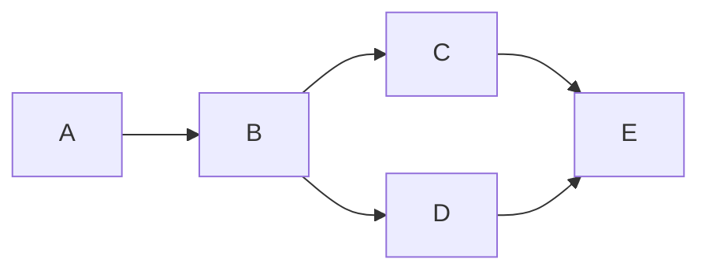

# Modelling systems as a workflow of tasks

**TODO:** This is a change requested by @Javier Toledo, to have an overview of the workflow before getting into explaining every piece of it. Will be done after the workflow page is finished.

Before delving into the concept of a task as the key component of our solution, it is essential to provide a brief introduction to the concept of a workflow as a means of orchestration. Details regarding this concept and the communication between tasks will be discussed later. At this point, it suffices to understand that any system orchestration situation can be modeled as a combination of tasks that run sequentially, in parallel, or in any combination thereof.

For instance, consider a series of tasks, labeled A and B, where task B depends on the outcome of task A. Task B cannot commence until task A has been completed. Similarly, if two other tasks C and D do not depend on each other but both rely on the outcome of task B, neither of them can initiate before task B has succeeded; however, tasks C and D do not have to wait for each other. Additionally, there may be a situation where yet another task, E, must wait for the completion of both tasks C and D.

The aforementioned configuration can be represented using a mermaid diagram as follows:

This example serves merely as an illustration of a possible task orchestration scenario. The crucial idea to grasp at this stage is that tasks can run in sequences or in parallel, forming execution graphs of arbitrary complexity. These execution graphs provide a mental map of the system's orchestration, enabling efficient and adaptable process modeling.
