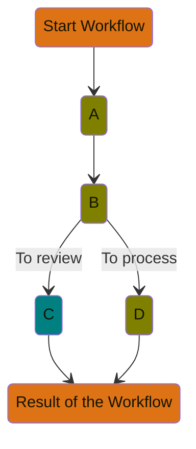

# Modelling systems as a workflow of tasks

Before delving into the concept of a task as the key component of our solution, it is essential to provide a brief introduction to the concept of a workflow as a means of orchestration. Details regarding this concept and the communication between tasks will be discussed later. At this point, it suffices to understand that any system orchestration situation can be modeled as a combination of tasks that run sequentially.

For instance, consider a series of tasks, labeled A to D, where task B is an action to be performed with information obtained from the result of A. Task A has the responsibility to start B. Then, when B completes, it will decide whether to continue with C, because customer support has to make a review, or D, which is a straightforward automatic process. Finally, either of them will emit an event with the outcome of the workflow.

The aforementioned configuration can be represented using a diagram as follows:

This example serves merely as an illustration of a possible task orchestration scenario. The crucial idea to grasp at this stage is that tasks will run in sequence, and that they are unlikely to show unexpected behavior, forming execution graphs of arbitrary complexity. These execution graphs provide a mental map of the system's orchestration, enabling efficient and adaptable process modeling.

More importantly, **there is no hidden complexity in these diagrams**, every possible outcome is represented in the graph.
