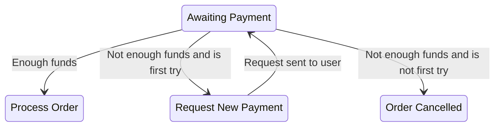

# The transition

One key element of the Railway Event Processor is that there is no concept of a failed task. Even for technical faults, the inability to attempt the task has to be translated into a business outcome.

That is, a payment might be successful or fail because of a lack of funds, this means that the payment itself can be rejected, but the task is not concerned whether the result was desirable or not, but about that, there was one of two possible results, and that each of them will lead to a different task in the flow.

In this example, a successful payment will lead to the fulfillment of the order, and a failed one will lead to a new request for payment to the user, possibly with a retry counter, which will eventually lead to the order being canceled.

> **!** A task that “fails” for business reasons it’s not considered a failure in this framework, as business failures (such as a payment rejected or not having permissions to perform an action) are abstracted as just one of several possible outcomes.
> 
>e.g. Performing a fraud check can determine whether the user is trustworthy or not. Both cases are just possible outcomes of the check: A result of potential fraud is not a failure but a successful verification that returned useful information.

The transition is represented as one of the following options:

1. A domain event that ends the workflow, this would be the outcome of the workflow.
2. The `State` that follows the decision.
3.  The `To Do Item` that follows the decision.

> **!** The domain event that ends the workflow can be used to chain parts of a more complex workflow.
