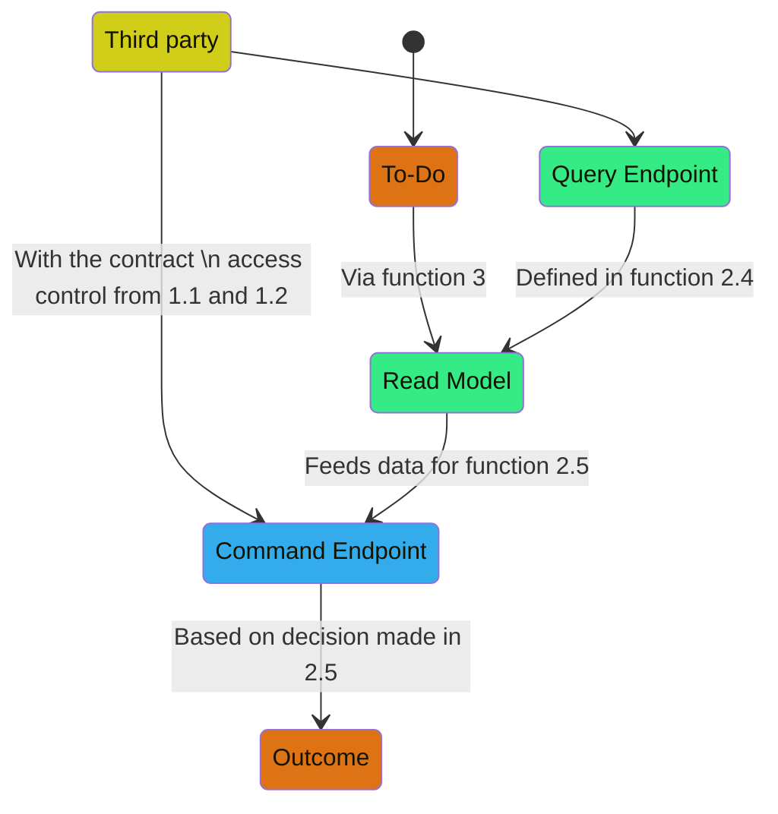
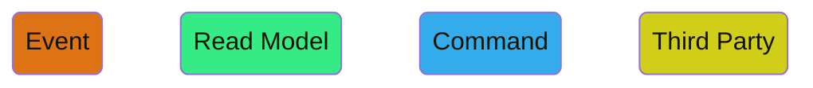
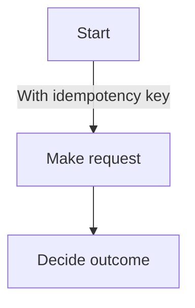
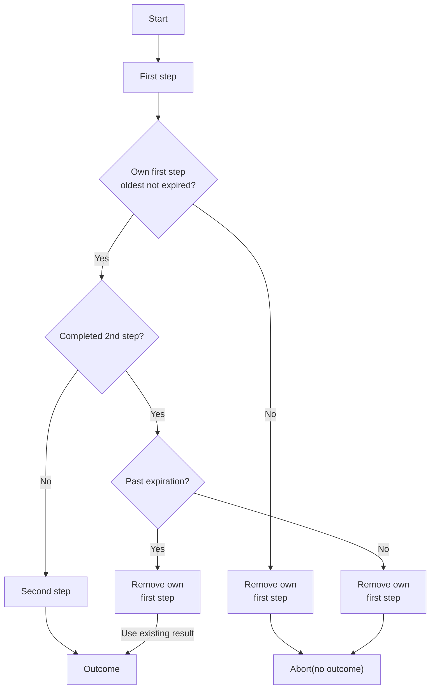
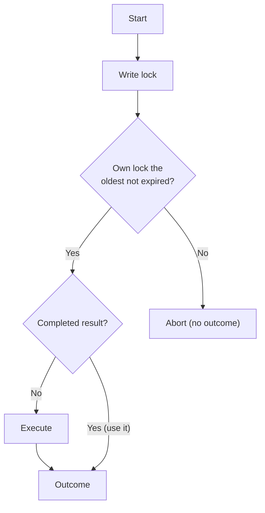
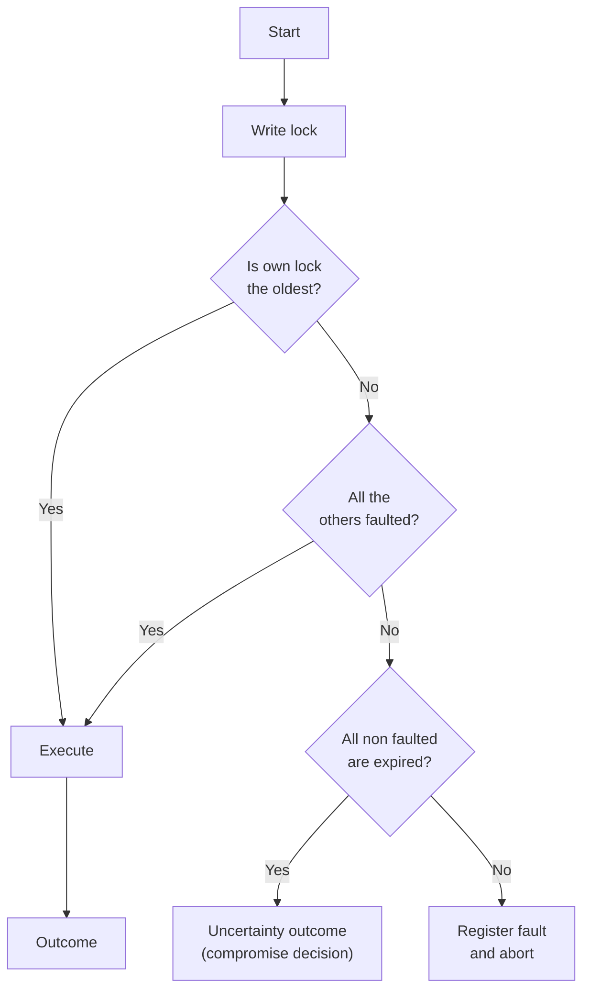

# Algorithms for each kind of Task

# Every task requires:

## Task identifier

A unique, human-readable identifier that is unique for the action that is being attempted and that **has to be consistently and deterministically generated only with the information contained in the event that triggered it**. It will be referred to as the `Task identifier`. Optionally, they can be part of the signature of the events that trigger a task. Some examples would be:

- `refund-eaf1c4d0-3cfd-4fb4-bae0-864a6142446d`
- `partial-payment-invoice-6ddcfdc3-8769-4f53-9cb8-66f6d6aa9b69-part-0` In this case, the event needs to carry the part, number and the aggregate responsible for it needs to keep track of which partial payment it is emitting the event for.
- `payment-initiated-6ddcfdc3-8769-4f53-9cb8-66f6d6aa9b69`

## Expiration functions

1. A function that receives the event that triggered the task, its `Task identifier`, and determines whether it still needs to be performed.
2. A function that maps the expiration to one of the possible transitions of the task.

# To-Do Item

Tasks that expose an endpoint that a third party must complete, this might even be a human actor. The abstraction requires the following definitions:

1. A read model definition.
2. An endpoint definition:
    1. Access control.
    2. A data contract.
    3. Type.
        1. Message queue.
        2. Synchronous API route segment (web API, GraphQL…)
    4. A function that queries the read model based on the information in the data received.
    5. A function that makes a decision based on both the read model and the data received, and **nothing else.**
3. A function that receives the event that leads to this task and generates a read model.

**The algorithm:**

**Legend:**

# State

Tasks that receive an event, attempt an action and, once successful, make a decision and emit a new event.

### Retriability

All state tasks can define retry logic, this is done through a back off function that receives how many times the function has been attempted, the event, the `Task identifier`and an optional error type (an exception in most languages), and returns either an amount of time to wait until the next attempt or a decision to not try again.

To implement this function, it is important to take into account the “retriability” of a task based on the risk assessment made in the business concern section.

1. At least once
2. Up to `n` times
3. At most once

In general, tasks falling into the first category can be retried until the timeout function stops the cycle. If that is the case, no retry back-off function is needed.

### Fault tolerance

All state tasks need to define a function that takes an error type, represented as `exceptions` in most languages, the event, and the `Task identifier`, and returns a business decision. This function will be called if the retriability function decides not to retry again.

## Idempotency enabled

This task is an integration with a third party that provides a mechanism to uniquely identify an action, often with an idempotency header, so the action can be attempted many times without producing the effect several times. The definition requires:

1. A function that receives the event and the `Task identifier`, attempts the action and with the result of it, makes a decision.

**The algorithm:**

## Optimistic lock enabled

This task is an integration with a third party that allows to perform an action in two steps, and determine whether the first step of the task is already underway by another process by querying for the first step based on some form of metadata that includes the `Task identifier`. The definition consists on:

1. A function that receives the event and the `Task identifier`, and attempts the first step of the task.
2. A function that receives the event and the `Task identifier`, and determines whether the action has already started.
3. A function that receives the event and the `Task identifier`, attempts the second step, and based 
4. An optional function that receives the event and the `Task identifier`, and undoes any incomplete attempt of the task.

The Task will:
1. Attempt the first step.
2. Verify that the first step just made is the oldest one not expired for this identifier.
    1. If it isn't, it tries to delete the step and exits without an outcome.
3. Verify that there isn't a completed second step for this identifier.
    1. If there is, it tries to delete the step and exits without an outcome.
4. Attempt the second step.
5. Generate an outcome with the result of the second step.

**The algorithm:**

## Pessimistic lock enabled

This task is an integration with a third party that allows to query if an attempt on the action has been performed before based on some form of metadata that includes the `Task identifier`. If it has, it has to be possible to get the outcome of that previous attempt. The definition consists on:

1. A function that receives the event and the `Task identifier`, attempts the task, and uses its outcome to make a decision.
2. A function that receives the event and the `Task identifier`, and determines whether the action has been tried before. If it has, reads the outcome of the task and makes a decision.
3. A property that delimits how long can the task take in an attempt, cancelling it after that time.

The Task will:
1. Write a lock for the `Task identifier`.
2. Verify that the lock just made is the oldest one not expired for this identifier.
    1. If it isn't, aborts without an outcome.
3. Verify that there isn't a completed action in the service for this identifier.
    1. If there is, it is guaranteed that the original process has expired, so emit an outcome with the result available.
4. Attempt the action.
5. Generate an outcome with the result.

**The algorithm:**

## Black boxed

This task in an integration with a third party that offers no way to determine whether an action or an attempt has been performed before. While it is possible to determine whether an attempt has started, it is not possible to determine if the third party actually received a request from the system unless the third party replied and the system was successful in storing the outcome.

Since the task is attempted via a pessimistic lock, it is possible this means that if an expired lock exists and no decision has been recorded, the state of `possible failure` is reached.

The definition of this task consists on:

1. A function that receives the event and the `Task identifier`, attempts the task, and uses its outcome to make a decision.
2. A function that receives the event, the `Task identifier`, and the time the previous attempt started and makes a decision.

The Task will:
1. Write a lock for the `Task identifier`.
2. Verify that the lock just made is the oldest one.
    1. If it isn't, verify that every previous lock is past expiration, and with a registered fault.
        1. If they all meet both conditions, continue.
        2. If there is at least one expired without a fault, emit an uncertainty outcome.
        3. If there is at least one that is neither expired nor faulted, register a fault for this attempt and abort without an outcome.
4. Attempt the action.
    1. If there's a fault, register the fault.
5. Generate an outcome with the result.

**The algorithm:**

