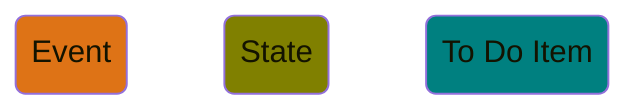
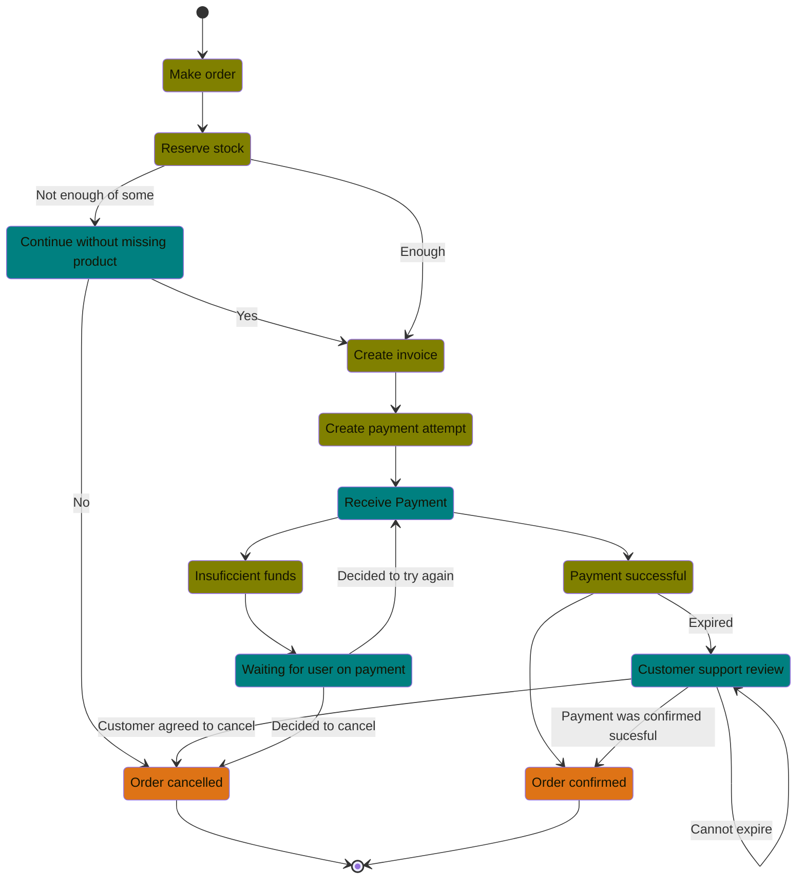

# The Workflow

# The core tenets of the framework

## Rejection is not failure

The concept of a `Task` is, when it comes to its outcome not concerned about which outcome means a success business wise, but about whether the action could be executed and a decision was made out of the outcome. This means that any possible result just represents the next possible state.

## Undo “A” is just do “B” when “A” has been done

While the `Task` is not concerned about business failure, the `Workflow` itself is, there are actions that might need to be undone if subsequent `Tasks` fail, this is not considered a special action in this framework, but just an action to perform after a certain precondition has been met.

## All parties are third parties

Even when the services integrated are developed, maintained and owned by the same company, even by the same team, treating any external service as a third party that can fail to respond leads to predictable software. While it might seem extreme, bear in mind that this treatment is done only once, as part of the framework, so the pressure of having to consider every outcome is released once designing the state machine.

## Yes, even people are third party services

In a `To Do Item`, an external action is awaited, this might come from an employee of the company owning the system, a confirmation from a user, or even a user from the third party needing to click on a link. The expiration scenario, that is, when the action never happens, must be a clearly visible part of the design, as it is not a matter of “if”, but of “when” will it happen.

## Insist, desist or react

As complex as the decisions for faults in a `Task` might seem, there are only three possible outcomes:

1. Retry the action, this is part of the retriability definition of the `Task`.
2. Desist in the attempt, that is, deciding not to retry, and in the fault mapping function, continue the workflow towards a different `State`.
3. React to the fault, that is, deciding not to retry, and in the fault mapping function, continue the workflow towards a `To Do Item`.

# The framework, by example

The following example is the creation of an order. So simplify the model, any fault and expiration result that maps to a default exit, `Order cancelled` in this case, can be left as an implicit mapping.

### Legend

